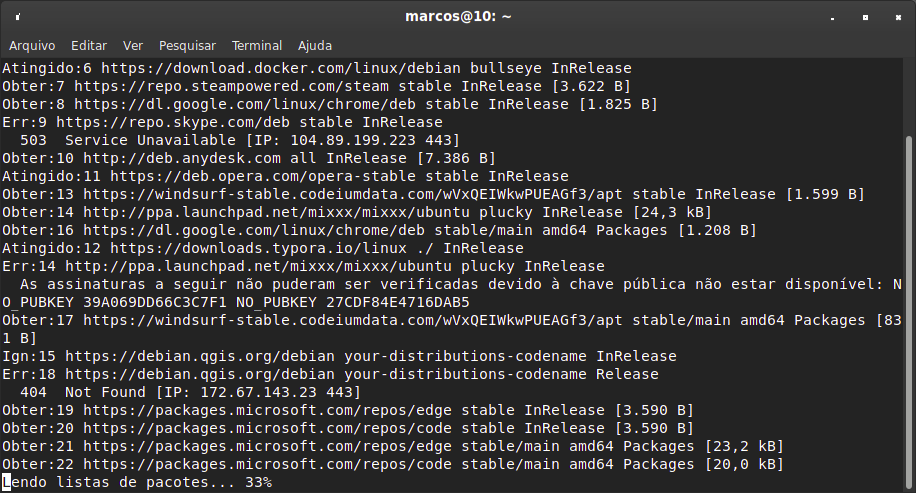

# [Laboratório GTi](../../README.md#laborat%C3%B3rio-gti "Laboratório GTi")

## Atualizações

[](./images/Upgrade_button.jpg "Atualizações")

### *Sumário*

- [🧬 Atualizar o kernel do Linux](#atualizar-o-kernel-do-linux "Atualizar o kernel do Linux")
- [🛠️ Corrigir Repositórios com Erro no APT (Debian/Ubuntu)](#%EF%B8%8F-corrigir-reposit%C3%B3rios-com-erro-no-apt-debianubuntu "Corrigir Repositórios com Erro no APT (Debian/Ubuntu)")
- [📘 Manutenção automática de disco no Debian (via systemd)](#-manuten%C3%A7%C3%A3o-autom%C3%A1tica-de-disco-no-debian-via-systemd "Manutenção automática de disco no Debian (via systemd)")


---

## Atualizar o kernel do Linux

Para atualizar o kernel do Linux, você precisará seguir algumas etapas, mas antes de prosseguir, é importante lembrar que a atualização do kernel pode ser um procedimento avançado e potencialmente arriscado. Se não for feito corretamente, pode levar a problemas de incompatibilidade com hardware ou software. Portanto, recomendo fazer um backup completo do seu sistema antes de prosseguir.

Aqui estão os passos gerais para atualizar o kernel no Debian ou em distribuições Linux baseadas no Debian:

1. Verifique a versão atual do kernel:
Antes de atualizar, verifique a versão do kernel atual em execução no seu sistema usando o seguinte comando:

```bash
uname -r
```

2. Verifique as atualizações disponíveis:
Atualmente, os kernels são geralmente gerenciados pelo sistema de gerenciamento de pacotes da sua distribuição. Use os seguintes comandos para atualizar a lista de pacotes disponíveis e verificar se há atualizações do kernel:

```bash
sudo apt update
sudo apt list --upgradable
```

Isso mostrará uma lista de pacotes, incluindo pacotes relacionados ao kernel que estão disponíveis para atualização.

3. Atualize o kernel:
Para atualizar o kernel, use o seguinte comando no Debian ou em distribuições baseadas no Debian:

```bash
sudo apt upgrade
```

Ou, para atualizar apenas o kernel e seus pacotes relacionados:

```bash
sudo apt install linux-image-amd64 linux-headers-amd64
```

Substitua "amd64" pela arquitetura correspondente do seu sistema (por exemplo, i386, arm64, etc.).

4. Reinicie o sistema:
Após a atualização do kernel, será necessário reiniciar o sistema para que a nova versão do kernel seja carregada.

5. Verifique a nova versão do kernel:
Após reiniciar, verifique se a nova versão do kernel foi instalada corretamente usando novamente o comando:

```bash
uname -r
```

Se a nova versão do kernel for exibida, a atualização foi bem-sucedida.

Lembre-se de que, se você estiver usando um gerenciador de inicialização como o GRUB, ele pode listar várias versões do kernel durante a inicialização. Se por algum motivo a nova versão do kernel não funcionar corretamente, você poderá selecionar a versão anterior do kernel na lista do GRUB e inicializar com ela.

Novamente, reforço a importância de fazer backup dos seus dados antes de qualquer procedimento de atualização do kernel. Se você não estiver confortável com essas etapas, é melhor buscar assistência de alguém mais experiente ou evitar atualizar o kernel. O kernel existente do Debian é geralmente estável e seguro, a menos que você precise especificamente de uma nova funcionalidade ou correção fornecida em uma versão mais recente.

[(&larr;) Voltar](https://github.com/systemboys/GTi_Laboratory#laborat%C3%B3rio-gti "Voltar ao Sumário") | 
[(&uarr;) Subir](#sum%C3%A1rio "Subir para o topo")

---

## 🛠️ Corrigir Repositórios com Erro no APT (Debian/Ubuntu)

[](./images/apt_update.png "Terminal após o comando apt update")

## 🛠️ **Corrigir Repositórios com Erro no APT (Debian/Ubuntu)**

### 📌 Objetivo:

Remover ou corrigir repositórios quebrados, duplicados ou com chave GPG inválida durante `apt update`.

### ✅ **Etapas Genéricas**

#### 1️⃣ Verificar erros com:

```bash
sudo apt update
```

> Copiar e analisar as linhas com `Err:` ou `NO_PUBKEY`, ou repositórios quebrados.

#### 2️⃣ Verificar repositórios principais:

```bash
sudo nano /etc/apt/sources.list
```

> ⚠️ Se não encontrar o repositório com erro, vá para o passo 3.

#### 3️⃣ Listar arquivos extras:

```bash
ls /etc/apt/sources.list.d/
```

> Aqui ficam os `.list` e `.sources` que podem conter os repositórios com problema.

#### 4️⃣ Identificar e **remover** os arquivos dos repositórios problemáticos:

```bash
sudo rm /etc/apt/sources.list.d/NOME_DO_ARQUIVO
```

> 💡 Ex:
> `skype-stable.list`, `qgis.sources`, `mixxx.list`, etc.

#### 5️⃣ Corrigir chave GPG faltando (se aplicável):

```bash
sudo apt-key adv --keyserver keyserver.ubuntu.com --recv-keys CHAVE_PUBKEY
```

> 🔑 Substitua `CHAVE_PUBKEY` pelo valor do erro, ex: `11EE8C00B693A745`

#### 6️⃣ Remover duplicação de repositórios (se houver):

* Identifique arquivos `.list` repetidos com o mesmo conteúdo.
* Remova o duplicado:

```bash
sudo rm /etc/apt/sources.list.d/ARQUIVO_DUPLICADO
```

#### 7️⃣ Testar novamente:

```bash
sudo apt update
```

> Tudo certo se não aparecerem mais erros!

### 💾 **Dica final**:

Mantenha seu sistema limpo e revise os repositórios após instalar programas de terceiros (como Skype, Anydesk, QGIS, etc.).

[(&larr;) Voltar](https://github.com/systemboys/GTi_Laboratory#laborat%C3%B3rio-gti "Voltar ao Sumário") | 
[(&uarr;) Subir](#sum%C3%A1rio "Subir para o topo")

---

## 📘 Manutenção automática de disco no Debian (via systemd)

### Objetivo

Evitar problemas de boot e travamentos causados por **disco cheio**, automatizando limpeza segura sempre que o sistema **desliga ou reinicia**.

---

### 1️⃣ Criar o script de manutenção

```bash
nano ~/manutencao-sistema.sh
```

#### Conteúdo do script:

```bash
#!/bin/bash

echo "=== Manutenção automática do sistema ==="

apt clean
apt autoremove -y
journalctl --vacuum-size=200M

apt remove --purge -y $(dpkg -l 'linux-image-*' \
 | awk '/^ii/{print $2}' \
 | sort -V \
 | head -n -2)

df -h /
echo "=== Manutenção concluída ==="
```

Salvar (`Ctrl+O`, Enter) e sair (`Ctrl+X`).

---

### 2️⃣ Tornar o script executável e mover para local do sistema

```bash
chmod +x ~/manutencao-sistema.sh
sudo mv ~/manutencao-sistema.sh /usr/local/bin/manutencao-sistema.sh
```

---

### 3️⃣ Criar o serviço systemd para rodar no desligamento

```bash
sudo nano /etc/systemd/system/manutencao-desligamento.service
```

#### Conteúdo do serviço:

```ini
[Unit]
Description=Manutenção automática antes do desligamento
DefaultDependencies=no
Before=shutdown.target reboot.target halt.target

[Service]
Type=oneshot
ExecStart=/usr/local/bin/manutencao-sistema.sh
TimeoutStartSec=0

[Install]
WantedBy=halt.target reboot.target shutdown.target
```

Salvar e sair.

---

### 4️⃣ Ativar o serviço

```bash
sudo systemctl daemon-reload
sudo systemctl enable manutencao-desligamento.service
```

Verificação:

```bash
systemctl status manutencao-desligamento.service
```

---

### 5️⃣ Teste manual (opcional)

```bash
sudo systemctl start manutencao-desligamento.service
df -h /
```

---

### Resultado final

✔ Executa automaticamente ao desligar ou reiniciar  
✔ Limpa cache do APT  
✔ Remove pacotes órfãos  
✔ Controla logs do systemd  
✔ Remove kernels antigos  
✔ Evita falha de boot por disco cheio  

---

📌 **Nota Codex:**

Este procedimento é seguro para uso contínuo em sistemas Debian/Ubuntu usados com atualizações frequentes.

---

[(&larr;) Voltar](https://github.com/systemboys/GTi_Laboratory#laborat%C3%B3rio-gti "Voltar ao Sumário") | 
[(&uarr;) Subir](#sum%C3%A1rio "Subir para o topo")

---