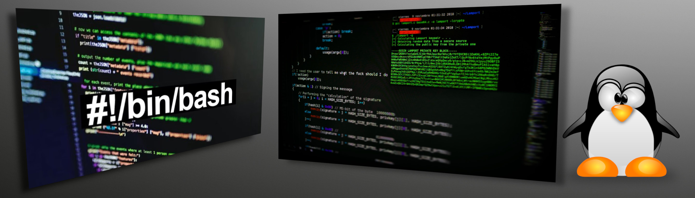
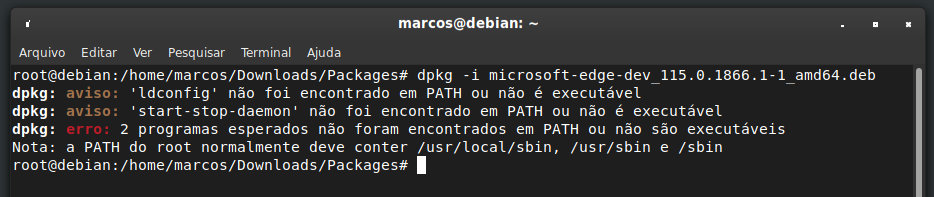
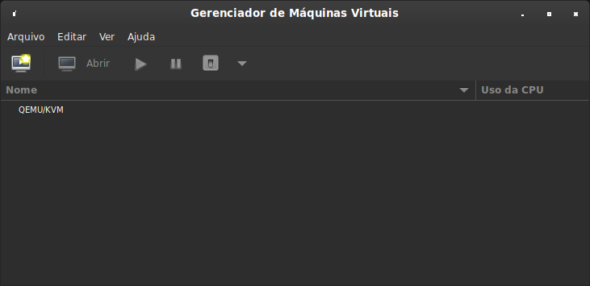

# [Laboratório GTi](../../README.md#laborat%C3%B3rio-gti "Laboratório GTi") / [Debian Linux e derivados](https://github.com/systemboys/GTi_Laboratory/tree/main/Debian%20Linux%20e%20derivados#debian-linux-e-derivados "Debian Linux e derivados")

## Instalação de pacotes

[](./images/Linux_terminal.jpg "Linux Terminal")

### *Sumário*

> Macetes
- [Erro de PATH após instalação de pacote .deb no Linux](#erro-de-path-ap%C3%B3s-instala%C3%A7%C3%A3o-de-pacote-deb-no-linux "Erro de PATH após instalação de pacote .deb no Linux")
   - [O Significado dos Arquivos (.deb) no Mundo Linux](#o-significado-dos-arquivos-deb-no-mundo-linux "O Significado dos Arquivos (.deb) no Mundo Linux")
- [Entendendo e Corrigindo Dependências Quebradas no Linux com 'apt --fix-broken install'](#entendendo-e-corrigindo-depend%C3%AAncias-quebradas-no-linux-com-sudo-apt---fix-broken-install "Entendendo e Corrigindo Dependências Quebradas no Linux com 'apt --fix-broken install'")
- [Resolvendo Dependências de Pacotes no Linux com o Comando apt-get install -f](#resolvendo-depend%C3%AAncias-de-pacotes-no-linux-com-o-comando-apt-get-install--f "Resolvendo Dependências de Pacotes no Linux com o Comando apt-get install -f")
   - [Corrigindo Pacotes Quebrados no Debian: Como Utilizar o Comando sudo apt --fix-broken install](#corrigindo-pacotes-quebrados-no-debian-como-utilizar-o-comando-sudo-apt---fix-broken-install "Corrigindo Pacotes Quebrados no Debian: Como Utilizar o Comando sudo apt --fix-broken install")
- [Liberação de Espaço no Linux: Usando o Comando apt autoremove para Remover Pacotes Não Necessários](#libera%C3%A7%C3%A3o-de-espa%C3%A7o-no-linux-usando-o-comando-apt-autoremove-para-remover-pacotes-n%C3%A3o-necess%C3%A1rios "Liberação de Espaço no Linux: Usando o Comando apt autoremove para Remover Pacotes Não Necessários")
> Instalação de alguns softwares via terminal
- [Instalar o Google Earth via terminal](#instalar-o-google-earth-via-terminal "Instalar o Google Earth via terminal")
- [Instalar o Microsoft Edge para Linux](#instalar-o-microsoft-edge-para-linux "Instalar o Microsoft Edge para Linux")
- [Instalar o Oracle Virtual Box no Debian Linux](#instalar-o-oracle-virtual-box-no-debian-linux "Instalar o Oracle Virtual Box no Debian Linux")
- [Instalar o Virt-Manager (Virtual Machine Manager)](#instalar-o-virt-manager-virtual-machine-manager "Instalar o Virt-Manager (Virtual Machine Manager)")
- 🖥️ [Instalação do `Ventoy` em Pendrive (Linux)](#%EF%B8%8F-instala%C3%A7%C3%A3o-do-ventoy-em-pendrive-linux "Instalação do Ventoy em Pendrive (Linux)")
- 🐧 [Criar `Pendrive Bootável` com `dd`](#-criar-pendrive-boot%C3%A1vel-com-dd "Criar Pendrive Bootável com dd")
> Dicas de Instalação e Desinstalação
- [Instalação e Desinstalação de Programas no Linux via Terminal](#instala%C3%A7%C3%A3o-e-desinstala%C3%A7%C3%A3o-de-programas-no-linux-via-terminal "Instalação e Desinstalação de Programas no Linux via Terminal")
   - [Identificar e remover programas no Linux usando o comando dpkg e apt no terminal](#identificar-e-remover-programas-no-linux-usando-o-comando-dpkg-e-apt-no-terminal "Identificar e remover programas no Linux usando o comando dpkg e apt no terminal")
   - [Verificar nome correto de pacote no sistema Debian](#verificar-nome-correto-de-pacote-no-sistema-debian "Verificar nome correto de pacote no sistema Debian")

---

## Erro de PATH após instalação de pacote .deb no Linux

Erro ao instalar um seguinte programa no Debian 10:

```bash
dpkg -i your_installation_package.deb
```

[](./images/Erro_PATH_do_root.png "Erro ao instalar programa")

O erro "E: Sub-process /usr/bin/dpkg returned an error code (1)" é geralmente um erro genérico que ocorre durante a instalação ou atualização de pacotes em sistemas operacionais baseados em Debian, como Ubuntu e Debian. Esse erro pode ser causado por uma série de problemas, como dependências quebradas, problemas de conflito entre pacotes ou problemas com o próprio pacote que está sendo instalado. Para resolver esse erro, é necessário identificar a causa específica do problema e corrigi-lo adequadamente.

Com editor de sua preferência edite o arquivo `./etc/profile`.

```bash
sudo nano /etc/profile
```

[](./images/Terminal_etc_profile.png "Terminal Profile")

Observe que haverá uma condição com valor verdadeiro ou falso:

```bash
if [ "$(id -u)" -eq 0 ]; then
  PATH="/usr/local/sbin:/usr/local/bin:/usr/sbin:/usr/bin:/sbin:/bin"
else
  PATH="/usr/local/bin:/usr/bin:/bin:/usr/local/games:/usr/games"
fi
```

Altere a linha no `else` da condição, adicionando um `/sbin` como no exemplo abaixo:

```bash
PATH="/usr/local/bin:/usr/bin:/bin:/usr/local/games:/usr/games/sbin"
```

Após modificar salve o arquivo e saia, você voltará para o terminal. Obs.: Se for no `nano`, execute os comandos:

| Comando | Descrição |
| :------------: | :------------ |
| Ctrl + O | Gravar alterações no arquivo |
| Ctrl + X | Sair do arquivo e voltar para o terminal |

Após editar, salvar e sair do arquivo, execute o seguinte comando:

```bash
source /etc/profile
```

Feito este processo, seu linux irá instalar normalmente o pacote através do `dpkg -i your_installation_package.deb`.

> ( ! ) Obs.: Em uma instalação futura, se houver o mesmo problema, faça o mesmo procedimento removendo o `/sbin`. No caso, algumas instalações exigirão o "/sbin" e outras não no valor "se falso" da condição.

Uma solução definitiva para o erro de `PATH` após a instalação de um pacote `.deb` é adicionar o caminho correto ao arquivo `/etc/environment`, que é lido pelo sistema no momento do login. Para fazer isso, você pode seguir estes passos:

1. Abra o arquivo `/etc/environment` em um editor de texto com privilégios de administrador:

   ```bash
   sudo nano /etc/environment
   ```

2. Adicione o caminho correto à variável `PATH`. Por exemplo, se o caminho correto for `/usr/local/bin`, adicione esta linha:

   ```bash
   PATH="/usr/local/sbin:/usr/local/bin:/usr/sbin:/usr/bin:/sbin:/bin:/usr/games:/usr/local/games:/snap/bin:/usr/local/bin"
   ```

3. Salve e feche o arquivo.

4. Recarregue o arquivo `/etc/environment` para que as alterações tenham efeito:

   ```bash
   source /etc/environment
   ```

Depois de seguir estes passos, o caminho correto deve estar configurado corretamente e o erro de `PATH` não deve mais ocorrer.

[(&larr;) Voltar](../../README.md#laborat%C3%B3rio-gti "Voltar ao Sumário") | 
[(&uarr;) Subir](#sum%C3%A1rio "Subir para o topo")

---

## O Significado dos Arquivos (.deb) no Mundo Linux

A extensão de arquivo ".deb" é uma abreviação de "Debian". Ela é usada para identificar pacotes de software que são projetados especificamente para sistemas operacionais baseados no Debian, como o próprio Debian, o Ubuntu e suas variantes, entre outros.

O sistema Debian é uma distribuição Linux renomada, conhecida por seu sistema de gerenciamento de pacotes, o "dpkg". Os arquivos de pacotes ".deb" contêm os binários, scripts e metadados necessários para instalar e configurar um software no sistema Debian.

A história dos arquivos ".deb" remonta ao projeto Debian, que começou em 1993. Eles foram criados como parte do sistema de gerenciamento de pacotes do Debian para facilitar a instalação, atualização e remoção de software de forma consistente e automatizada em sistemas Debian e derivados.

Portanto, quando você encontra um arquivo com a extensão ".deb", pode ter certeza de que é destinado principalmente a sistemas baseados no Debian e é compatível com ferramentas de gerenciamento de pacotes como "dpkg", "apt" e "apt-get".

[(&larr;) Voltar](../../README.md#laborat%C3%B3rio-gti "Voltar ao Sumário") | 
[(&uarr;) Subir](#sum%C3%A1rio "Subir para o topo")

---

## Entendendo e Corrigindo Dependências Quebradas no Linux com "sudo apt --fix-broken install"

```bash
sudo apt --fix-broken install
```

**Explicação:**

O comando "sudo apt --fix-broken install" é utilizado no sistema operacional Linux, especificamente em distribuições que utilizam o gerenciador de pacotes APT (Advanced Package Tool), como o Ubuntu. Este comando é projetado para corrigir pacotes quebrados ou dependências ausentes que podem ocorrer durante a instalação, atualização ou remoção de software.

A quebra de dependências geralmente ocorre quando há interrupções no processo de instalação de pacotes, atualizações incompletas ou quando pacotes necessários para o funcionamento adequado de outros pacotes estão ausentes.

Ao executar esse comando com privilégios de superusuário (sudo), o sistema tenta resolver automaticamente as dependências quebradas, baixando e instalando os pacotes necessários. Ele também pode sugerir a remoção de pacotes problemáticos ou realizar outras ações para garantir a integridade do sistema.

Portanto, o "sudo apt --fix-broken install" é uma ferramenta útil para manter a estabilidade do sistema Linux, garantindo que todas as dependências necessárias para o funcionamento adequado dos programas sejam satisfeitas.

[(&larr;) Voltar](../../README.md#laborat%C3%B3rio-gti "Voltar ao Sumário") | 
[(&uarr;) Subir](#sum%C3%A1rio "Subir para o topo")

---

## Resolvendo Dependências de Pacotes no Linux com o Comando apt-get install -f

O comando `apt-get install -f` é usado para resolver dependências quebradas ou pacotes desinstalados/incompletos no sistema Linux. A opção `-f` é uma abreviação de `--fix-broken`, que indica ao gerenciador de pacotes para tentar corrigir qualquer problema com pacotes que estão parcialmente instalados, desinstalados ou com dependências que não foram satisfeitas.

Quando você executa `apt-get install -f`, o sistema irá:

1. Verificar os pacotes que estão parcialmente instalados ou que possuem dependências não satisfeitas.

2. Tentar resolver os problemas baixando e instalando os pacotes necessários para satisfazer as dependências faltantes.

3. Pode, em alguns casos, remover pacotes problemáticos que estão causando conflitos com outros pacotes ou impedindo a conclusão da instalação.

Este comando é útil quando você encontra mensagens de erro relacionadas a dependências ou quando alguma instalação foi interrompida e precisa ser corrigida.

Lembre-se de que você precisa ter privilégios de administrador (usando `sudo`) para executar esse comando, pois ele lida com operações que afetam o sistema como um todo.

[(&larr;) Voltar](../../README.md#laborat%C3%B3rio-gti "Voltar ao Sumário") | 
[(&uarr;) Subir](#sum%C3%A1rio "Subir para o topo")

---

## Corrigindo Pacotes Quebrados no Debian: Como Utilizar o Comando sudo apt --fix-broken install

O comando `sudo apt --fix-broken install` é utilizado para corrigir problemas de dependências de pacotes no sistema Debian e em distribuições baseadas nele, como Ubuntu, Mint, etc.

### Objetivo do comando:

Ele serve para resolver situações onde o sistema apresenta pacotes quebrados, ou seja, pacotes que não foram instalados corretamente devido à falta de dependências ou conflitos entre dependências. Esses problemas podem surgir quando a instalação de um pacote falha, deixando o sistema com pacotes parcialmente instalados ou pacotes que requerem outros pacotes que ainda não estão presentes ou corretamente instalados.

### Estrutura:

- `sudo`: Executa o comando com permissões de superusuário, o que é necessário para instalar ou modificar pacotes no sistema.
- `apt`: O gerenciador de pacotes do Debian, utilizado para instalar, atualizar, remover pacotes e gerenciar dependências.
- `--fix-broken`: Esta opção indica ao `apt` que ele deve tentar corrigir pacotes quebrados no sistema. Isso pode significar instalar dependências ausentes, remover pacotes que estão em conflito ou corrigir pacotes parcialmente instalados.
- `install`: Indica que o comando deve instalar os pacotes que faltam para corrigir os problemas.

### Quando usar:

Esse comando é útil quando você tenta instalar ou atualizar um pacote e o processo falha devido a pacotes quebrados ou dependências que não foram resolvidas corretamente. Ele verifica o sistema em busca de pacotes que precisam ser reparados e tenta corrigir esses problemas automaticamente.

### Exemplo de uso:

1. Você tenta instalar um programa com `sudo apt install nome_do_pacote` e recebe um erro indicando que há pacotes quebrados ou dependências que não foram atendidas.
2. Ao tentar qualquer outro comando do `apt`, ele também pode informar que o sistema está em um estado inconsistente.
3. Para corrigir, você roda:

   ```bash
   sudo apt --fix-broken install
   ```

4. O `apt` tentará instalar as dependências que faltam, remover pacotes quebrados ou fazer ajustes necessários para colocar o gerenciador de pacotes em um estado consistente.

### Cenário comum de uso:

Suponha que você tentou instalar o AnyDesk, e ele falhou devido a dependências ausentes. Ao executar o comando:

```bash
sudo dpkg -i anydesk_*.deb
```

Se houver dependências não atendidas, você verá um erro sobre pacotes quebrados. Nesse ponto, o sistema pode sugerir o uso de `sudo apt --fix-broken install` para corrigir essas dependências e finalizar a instalação.

### Resumindo:
O comando `sudo apt --fix-broken install` é uma ferramenta poderosa para resolver automaticamente problemas de pacotes no sistema, corrigindo pacotes quebrados e garantindo que o sistema continue funcionando corretamente.

Se tiver dúvidas sobre um caso específico de dependências quebradas ou erros, sinta-se à vontade para compartilhar que eu posso ajudar com mais detalhes!

[(&larr;) Voltar](../../README.md#laborat%C3%B3rio-gti "Voltar ao Sumário") | 
[(&uarr;) Subir](#sum%C3%A1rio "Subir para o topo")

---

## Liberação de Espaço no Linux: Usando o Comando apt autoremove para Remover Pacotes Não Necessários

O comando `apt autoremove` é usado no sistema operacional Linux (especialmente em distribuições baseadas em Debian, como o Ubuntu) para remover automaticamente pacotes que não são mais necessários, ou seja, pacotes que foram instalados como dependências de outros pacotes, mas que não são mais necessários por nenhum outro pacote instalado.

Quando você instala um pacote que tem dependências, o sistema também instala automaticamente as dependências necessárias. No entanto, quando você remove um pacote principal, as dependências já não são mais necessárias, e é aí que o `apt autoremove` entra em ação.

Ao executar `apt autoremove`, o sistema verifica as dependências que foram instaladas e não são mais necessárias (pois não têm mais nenhum pacote dependente), e então as remove, liberando espaço no sistema.

Em resumo, o comando `apt autoremove` ajuda a limpar o sistema, removendo pacotes que não têm mais utilidade após a remoção de pacotes principais. Certifique-se de que você realmente não precisa dessas dependências antes de executar o comando, pois ele pode remover pacotes que não são mais necessários, mas tenha cuidado para não remover algo importante acidentalmente.

[(&larr;) Voltar](../../README.md#laborat%C3%B3rio-gti "Voltar ao Sumário") | 
[(&uarr;) Subir](#sum%C3%A1rio "Subir para o topo")

---

## Instalar o Google Earth via terminal

O Google Earth não está disponível nos repositórios oficiais do Debian, mas você pode baixar e instalar o pacote .deb do Google Earth diretamente do site oficial. 

Siga as etapas abaixo para instalar o Google Earth no Debian Linux via terminal:

1. Abra um terminal.

2. Baixe o pacote .deb mais recente do Google Earth usando o comando `wget`. Certifique-se de escolher a versão correta para o seu sistema operacional (32 bits ou 64 bits):

   - Para sistemas de 32 bits:

     ```bash
     wget https://dl.google.com/dl/earth/client/current/google-earth-stable_current_i386.deb
     ```

   - Para sistemas de 64 bits:

     ```bash
     wget https://dl.google.com/dl/earth/client/current/google-earth-stable_current_amd64.deb
     ```

3. Após o download, instale o pacote .deb usando o comando `dpkg`:

   ```bash
   sudo dpkg -i google-earth-stable_current_*.deb
   ```

4. Se ocorrerem dependências ausentes durante a instalação, execute o seguinte comando para corrigir e instalar as dependências necessárias:

   ```bash
   sudo apt install -f
   ```

5. Após a instalação, você pode iniciar o Google Earth digitando `google-earth-pro` no terminal ou procurando-o no menu de aplicativos.

Lembre-se de ter privilégios administrativos para executar os comandos com `sudo`. Certifique-se também de baixar a versão correta do Google Earth para o seu sistema operacional (32 bits ou 64 bits) e de atualizar os comandos acima com o nome do arquivo .deb baixado, se necessário.

[(&larr;) Voltar](../../README.md#laborat%C3%B3rio-gti "Voltar ao Sumário") | 
[(&uarr;) Subir](#sum%C3%A1rio "Subir para o topo")

---

## Instalar o Microsoft Edge para Linux

A Microsoft fornece versões do Microsoft Edge para Linux por meio de seu próprio repositório. No entanto, o Microsoft Edge não oferece um link direto para download via "wget" como os pacotes DEB tradicionais. Em vez disso, é necessário adicionar o repositório oficial e, em seguida, usar o gerenciador de pacotes, como o `apt`, para instalar o Microsoft Edge.

Aqui estão os passos para instalar o Microsoft Edge no Linux usando o terminal:

1. **Adicione o Repositório:**
   Abra o terminal e execute os seguintes comandos para adicionar o repositório do Microsoft Edge:

   ```bash
   curl https://packages.microsoft.com/keys/microsoft.asc | gpg --dearmor > microsoft.gpg
   sudo mv microsoft.gpg /etc/apt/trusted.gpg.d/microsoft.gpg
   sudo sh -c 'echo "deb [arch=amd64] https://packages.microsoft.com/repos/edge stable main" > /etc/apt/sources.list.d/microsoft-edge-dev.list'
   ```

2. **Atualize a Lista de Pacotes:**
   Execute o seguinte comando para atualizar a lista de pacotes disponíveis:

   ```bash
   sudo apt update
   ```

3. **Instale o Microsoft Edge:**
   Agora, você pode instalar o Microsoft Edge usando o seguinte comando:

   ```bash
   sudo apt install microsoft-edge-dev
   ```

Isso fará o download e a instalação do Microsoft Edge diretamente do repositório oficial da Microsoft.

Lembre-se de que você precisará ter privilégios de administrador (sudo) para executar esses comandos.

Essas etapas garantirão a instalação apropriada e atualizações futuras do Microsoft Edge no seu sistema Linux.

[(&larr;) Voltar](../../README.md#laborat%C3%B3rio-gti "Voltar ao Sumário") | 
[(&uarr;) Subir](#sum%C3%A1rio "Subir para o topo")

---

## Instalar o Oracle Virtual Box no Debian Linux

Para instalar o Oracle VirtualBox no Debian Linux, você pode seguir as seguintes etapas:

1. Abra um terminal.

2. Adicione o repositório do VirtualBox ao seu sistema executando o seguinte comando:

```bash
sudo sh -c 'echo "deb [arch=amd64] https://download.virtualbox.org/virtualbox/debian $(lsb_release -sc) contrib" >> /etc/apt/sources.list.d/virtualbox.list'
```

3. Baixe e importe a chave GPG do VirtualBox para verificar a autenticidade dos pacotes:

```bash
wget -q https://www.virtualbox.org/download/oracle_vbox_2016.asc -O- | sudo apt-key add -
```

4. Atualize a lista de pacotes disponíveis:

```bash
sudo apt update
```

5. Instale o VirtualBox:

```bash
sudo apt install virtualbox-6.1
```

6. Após a instalação, você pode executar o VirtualBox a partir do menu de aplicativos ou digitando o comando `virtualbox` no terminal.

Certifique-se de ter privilégios administrativos para executar os comandos com `sudo`. Além disso, verifique a versão mais recente do VirtualBox no site oficial (https://www.virtualbox.org) para garantir que você está instalando a versão correta.

Observação: Se você estiver usando uma versão diferente do Debian, substitua `$(lsb_release -sc)` pelo código do seu sistema, como "buster" para o Debian 10.

[(&larr;) Voltar](../../README.md#laborat%C3%B3rio-gti "Voltar ao Sumário") | 
[(&uarr;) Subir](#sum%C3%A1rio "Subir para o topo")

---

# Instalar o Virt-Manager (Virtual Machine Manager)



O programa exibido na imagem é o **Virt-Manager** (Virtual Machine Manager), um popular gerenciador de máquinas virtuais para sistemas Linux. Ele é uma interface gráfica para o QEMU/KVM e outras tecnologias de virtualização, permitindo criar, configurar e gerenciar máquinas virtuais.

No Debian, você pode instalar o Virt-Manager usando o seguinte comando no terminal:

```bash
sudo apt-get install virt-manager
```

Após a instalação, você poderá utilizar o Virt-Manager para gerenciar suas máquinas virtuais de maneira similar ao que é mostrado na imagem.

[(&larr;) Voltar](../../README.md#laborat%C3%B3rio-gti "Voltar ao Sumário") | 
[(&uarr;) Subir](#sum%C3%A1rio "Subir para o topo")

---

## 🖥️ Instalação do Ventoy em Pendrive (Linux)

### 📥 Download

1. Baixar o Ventoy no site oficial:
   👉 [https://www.ventoy.net/en/download.html](https://www.ventoy.net/en/download.html)

2. Extrair o pacote:

   ```bash
   tar -xzvf ventoy-x.x.xx-linux.tar.gz
   cd ventoy-x.x.xx
   ```

### 🔎 Identificar o pendrive

Listar dispositivos conectados:

```bash
lsblk
```

> Exemplo do que verá após executar o comando `lsblk`:

```bash
root@10:/home/marcos/Downloads/ventoy-1.1.07# lsblk
NAME   MAJ:MIN RM   SIZE RO TYPE MOUNTPOINT
loop0    7:0    0 173,2M  1 loop /snap/skype/394
loop1    7:1    0  50,8M  1 loop /snap/snapd/25202
loop2    7:2    0  55,5M  1 loop /snap/core18/2934
loop3    7:3    0  49,3M  1 loop /snap/snapd/24792
loop4    7:4    0 182,3M  1 loop /snap/skype/392
loop5    7:5    0  55,5M  1 loop /snap/core18/2940
loop6    7:6    0 164,8M  1 loop /snap/gnome-3-28-1804/198
loop7    7:7    0  91,7M  1 loop /snap/gtk-common-themes/1535
loop8    7:8    0     4K  1 loop /snap/bare/5
sda      8:0    0 223,6G  0 disk 
├─sda1   8:1    0  93,2G  0 part /
├─sda2   8:2    0     1K  0 part 
├─sda5   8:5    0   4,7G  0 part [SWAP]
└─sda6   8:6    0 125,7G  0 part /home
sdb      8:16   1   7,5G  0 disk 
└─sdb1   8:17   1   7,5G  0 part /media/marcos/133DA2E66CBFDA43
sr0     11:0    1  1024M  0 rom
```

Exemplo de saída:

```
sda  → Disco do sistema
sdb  → Pendrive
```

⚠️ Certifique-se de usar o **dispositivo correto** (`/dev/sdb`, por exemplo), pois o Ventoy irá formatar.

### ⚡ Instalação

Instalar o Ventoy no pendrive:

```bash
sudo ./Ventoy2Disk.sh -i /dev/sdX
```

(Substituir `sdX` pelo dispositivo real, ex.: `sdb`)

### 🔄 Atualização

Para atualizar sem perder as ISOs já copiadas:

```bash
sudo ./Ventoy2Disk.sh -u /dev/sdX
```

### ⚠️ Observação importante

Se ao usar `-u` aparecer a mensagem:

```
/dev/sdX does not contain Ventoy or data corrupted
Please use -i option if you want to install ventoy to /dev/sdX
```

➡️ Nesse caso, use **`-i`** no lugar de `-u`, pois significa que o pendrive ainda não tem o Ventoy instalado.

### 🚀 Como usar

1. Copiar arquivos **.iso** direto para o pendrive.
2. Dar boot pelo pendrive no computador.
3. O Ventoy exibirá um menu com todas as ISOs disponíveis para inicialização.

[(&larr;) Voltar](../../README.md#laborat%C3%B3rio-gti "Voltar ao Sumário") | 
[(&uarr;) Subir](#sum%C3%A1rio "Subir para o topo")

---

## 🐧 Criar Pendrive Bootável com `dd`

Para gravar uma ISO diretamente em um pendrive e torná-lo bootável no Linux, pode-se usar o comando:

```bash
sudo dd if=MiniOS.iso of=/dev/sdX bs=4M status=progress conv=fsync
```

### 🔎 Explicação dos parâmetros:

* **`if=MiniOS.iso`** → Arquivo de entrada (a ISO da distro).
* **`of=/dev/sdX`** → Destino (substitua `sdX` pelo dispositivo do pendrive, ex: `/dev/sdb`).
* **`bs=4M`** → Define tamanho dos blocos como 4 MB (cópia mais rápida).
* **`status=progress`** → Mostra o progresso da gravação.
* **`conv=fsync`** → Garante que os dados sejam gravados fisicamente antes de finalizar.

### ⚠️ Atenção

* Verifique o dispositivo correto com `lsblk` ou `fdisk -l`.
* Se errar e usar o disco do sistema (`/dev/sda`), pode apagar todo o sistema.

📦 Disponibilidade
O comando `dd` já vem instalado por padrão na maioria das distribuições Linux, pois faz parte do pacote coreutils. Só em sistemas extremamente minimalistas ele pode não estar presente — nesses casos, basta instalar o pacote `coreutils` pelo gerenciador de pacotes da distro.

### 🆚 Diferença em relação ao Ventoy

* **`dd`**: grava apenas **uma ISO por vez**, substitui tudo no pendrive.
* **Ventoy**: permite copiar várias ISOs no mesmo pendrive e escolher no boot.

### 💡 Observação

Caso o comando falhe em alguns ambientes, pode-se tentar com `-i` ao invés de `-u`:

```bash
sudo dd if=MiniOS.iso of=/dev/sdX bs=4M status=progress conv=fsync -i
```

[(&larr;) Voltar](../../README.md#laborat%C3%B3rio-gti "Voltar ao Sumário") | 
[(&uarr;) Subir](#sum%C3%A1rio "Subir para o topo")

---

## Instalação e Desinstalação de Programas no Linux via Terminal

Exemplo 1: Instalando o TigerVNC
1. Abra o terminal em seu sistema.

2. Execute o seguinte comando para instalar o TigerVNC:

   ```bash
   sudo apt install tigervnc-scraping-server
   ```
3. Aguarde até que o processo de instalação seja concluído.

Exemplo 2: Desinstalando o TigerVNC

1. Abra o terminal em seu sistema.

2. Execute o seguinte comando para desinstalar o TigerVNC:

   ```bash
   sudo apt remove tigervnc-scraping-server
   ```
3. Aguarde até que o processo de desinstalação seja concluído.

Exemplo 3: Instalando o RealVNC Viewer

1. Abra o terminal em seu sistema.

2. Execute o seguinte comando para instalar o RealVNC Viewer:

   ```bash
   sudo dpkg -i realvnc-vnc-viewer.deb
   ```
   (substitua "realvnc-vnc-viewer.deb" pelo nome do pacote .deb que você baixou)

3. Aguarde até que o processo de instalação seja concluído.

Exemplo 4: Desinstalando o RealVNC Viewer

1. Abra o terminal em seu sistema.

2. Execute o seguinte comando para desinstalar o RealVNC Viewer:

   ```bash
   sudo dpkg -r realvnc-vnc-viewer
   ```
   > Ou, remover o AnyDesk e seus arquivos de configuração:

   ```bash
   sudo apt-get autoremove
   ```

   > Este comando elimina pacotes que foram instalados como dependências do AnyDesk e que não são mais necessários.

3. Aguarde até que o processo de desinstalação seja concluído.

4. Remover dependências não utilizadas:

   ```bash
   sudo apt-get autoremove
   ```

   > Este comando elimina pacotes que foram instalados como dependências do Programa e que não são mais necessários.

5. Limpar o cache de pacotes obsoletos:

   ```bash
   sudo apt-get autoclean
   ```

   > Este comando remove pacotes obsoletos do cache local que não são mais necessários.
   >
   > Certifique-se de que o Programa não esteja em execução antes de iniciar o processo de desinstalação. Você pode verificar se há processos ativos do Programa com o comando `ps aux | grep Programa` e encerrá-los, se necessário.​
   >
   > Após executar esses comandos, o Programa será completamente removido do seu sistema Debian.
   
Certifique-se de adaptar os comandos de instalação e desinstalação de acordo com o programa que você está instalando ou removendo.

Ao seguir esses exemplos, você poderá fazer a instalação e desinstalação de programas no Linux via terminal.

Lembre-se de verificar a documentação oficial do programa e fazer backup de dados importantes antes de realizar qualquer alteração em seu sistema.

[(&larr;) Voltar](../../README.md#laborat%C3%B3rio-gti "Voltar ao Sumário") | 
[(&uarr;) Subir](#sum%C3%A1rio "Subir para o topo")

---

## Identificar e remover programas no Linux usando o comando dpkg e apt no terminal

Identificar o programa para removê-lo via comando no terminal Linux. Você pode usar o comando `dpkg --list` para listar todos os pacotes instalados no sistema. Em seguida, você pode filtrar a saída usando o comando `grep` e fornecer um trecho do nome do programa que você deseja desinstalar.

Por exemplo, se você lembrar que o programa possui a palavra "editor" no nome, você pode executar o seguinte comando:

```bash
dpkg --list | grep editor
```

Isso mostrará uma lista dos pacotes instalados que contêm a palavra "editor" no nome. A partir daí, você pode identificar o pacote específico que deseja desinstalar e usar o comando `apt remove` seguido do nome do pacote para removê-lo.

Tenha cuidado ao desinstalar pacotes usando esse método, pois é importante identificar corretamente o pacote que você deseja remover para evitar a remoção de pacotes indesejados.

> ( ! ) Sobre `dpkg` e `apt`!

O comando `dpkg --list | grep program_name` é útil para identificar programas instalados por meio do sistema de gerenciamento de pacotes `dpkg`, que é a base do sistema de gerenciamento de pacotes Debian. No entanto, para programas instalados via `apt`, que é uma interface de gerenciamento de pacotes que utiliza o `dpkg` por baixo dos panos, você pode usar diretamente o comando `apt list`.

Para identificar programas instalados usando o `apt`, você pode usar o seguinte comando:

```bash
apt list --installed | grep program_name
```

Substitua "program_name" pelo nome ou parte do nome do programa que você está procurando.

Esse comando lista todos os pacotes instalados pelo `apt` (incluindo os do `dpkg`) e, em seguida, o comando `grep` filtra o resultado para mostrar apenas as linhas que correspondem ao nome do programa que você está procurando.

Lembre-se de que o comando `apt` é uma camada de gerenciamento de pacotes mais amigável que envolve o `dpkg`. Portanto, a maioria dos programas instalados usando o `apt` também estará listada se você usar o comando `dpkg --list`, mas o comando `apt list` é mais direto para listar programas instalados através do `apt`.

[(&larr;) Voltar](../../README.md#laborat%C3%B3rio-gti "Voltar ao Sumário") | 
[(&uarr;) Subir](#sum%C3%A1rio "Subir para o topo")

---

## Verificar nome correto de pacote no sistema Debian

Para verificar o nome correto do pacote no sistema Debian, você pode usar o comando `apt search` ou `apt-cache search` seguido por uma palavra-chave relacionada ao pacote que você está procurando. Isso exibirá uma lista de pacotes que correspondem à palavra-chave fornecida. 

No seu caso, para verificar o nome correto do pacote "bashtop", você pode fazer o seguinte:

```bash
apt search bashtop
```

ou

```bash
apt-cache search bashtop
```

Esses comandos irão listar os pacotes cujos nomes ou descrições incluem a palavra-chave "bashtop". Você pode então ver se o pacote que você está procurando está listado e verificar o nome correto dele.

Lembre-se de executar esses comandos com privilégios de administrador (sudo). Se o pacote "bashtop" estiver disponível nos repositórios configurados, você deverá ver o nome correto e outras informações relacionadas a ele.

[(&larr;) Voltar](../../README.md#laborat%C3%B3rio-gti "Voltar ao Sumário") | 
[(&uarr;) Subir](#sum%C3%A1rio "Subir para o topo")

---