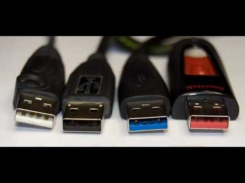

# Cores de Portas USB

As diferentes cores nas pontas das portas USB indicam diferentes tipos de USB, cada uma com características e capacidades específicas. Aqui está uma breve explicação das cores mais comuns:

1. **Branco**:
   - **USB 1.x**: Essa é a primeira versão do USB, com uma velocidade de transferência de dados de até 12 Mbps. É rara de se encontrar hoje em dia, mas ainda pode ser vista em dispositivos muito antigos.

2. **Preto**:
   - **USB 2.0**: Esta é uma versão mais comum e amplamente utilizada, com uma velocidade de transferência de dados de até 480 Mbps. É compatível com a maioria dos dispositivos periféricos, como teclados, mouses e impressoras.

3. **Azul**:
   - **USB 3.0**: Esta versão oferece uma velocidade de transferência de dados significativamente mais alta, de até 5 Gbps. As portas e cabos USB 3.0 são frequentemente azuis para diferenciá-los dos USB 2.0.

4. **Vermelho ou Amarelo**:
   - **USB 3.1 ou USB 3.2**: Estas versões podem oferecer velocidades de transferência ainda mais altas, chegando a 10 Gbps (USB 3.1) ou até 20 Gbps (USB 3.2). As portas podem ser de várias cores, incluindo vermelho, para indicar capacidades de carregamento rápido.

Essas cores ajudam a identificar rapidamente as capacidades das portas e dos cabos USB, facilitando a escolha correta para suas necessidades de transferência de dados e carregamento.