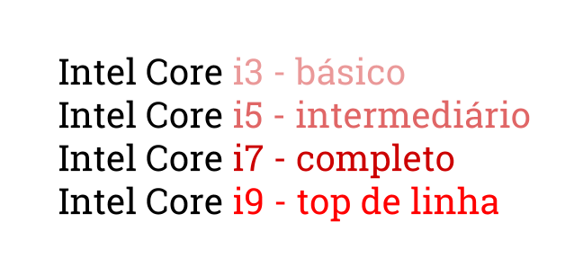
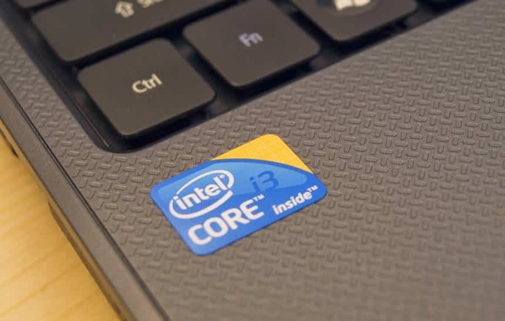

# [Laboratório GTi](https://github.com/systemboys/GTi_Laboratory#laborat%C3%B3rio-gti "Laboratório GTi")

## Geração de Processadores

### *Sumário*

> Processadores Intel

- [Guia das Gerações: Processadores Intel Core i até 2021](#guia-das-gera%C3%A7%C3%B5es-processadores-intel-core-i-at%C3%A9-2021 "Guia das Gerações: Processadores Intel Core i até 2021")
    - [i3, i5, i7 e i9: entenda a diferença entre os processadores da Intel](#i3-i5-i7-e-i9-entenda-a-diferen%C3%A7a-entre-os-processadores-da-intel "i3, i5, i7 e i9: entenda a diferença entre os processadores da Intel")
    - [O que você precisa saber](#o-que-voc%C3%AA-precisa-saber "O que você precisa saber")
    - [Gerações](#gera%C3%A7%C3%B5es "Gerações")
    - [U, Y, T, Q, H e K](#u-y-t-q-h-e-k "U, Y, T, Q, H e K")
    - [Cache](#cache "Cache")
    - [Outros detalhes](#outros-detalhes "Outros detalhes")
    - [Qual comprar?](#qual-comprar "Qual comprar?")

---

[(&larr;) Voltar](https://github.com/systemboys/GTi_Laboratory#laborat%C3%B3rio-gti "Voltar ao Sumário") | 
[(&uarr;) Subir](#sum%C3%A1rio "Subir para o topo")

---

## Guia das Gerações: Processadores Intel Core i até 2021

Aqui está uma lista resumida das principais gerações de processadores Intel Core `i`, começando com a primeira geração:

1. **Primeira Geração (Nehalem):**
   - Intel Core i3-5xx, i5-6xx, i7-8xx, i7-9xx

2. **Segunda Geração (Sandy Bridge):**
   - Intel Core i3-2xxx, i5-2xxx, i7-2xxx

3. **Terceira Geração (Ivy Bridge):**
   - Intel Core i3-3xxx, i5-3xxx, i7-3xxx

4. **Quarta Geração (Haswell):**
   - Intel Core i3-4xxx, i5-4xxx, i7-4xxx

5. **Quinta Geração (Broadwell):**
   - Intel Core i3-5xxx, i5-5xxx, i7-5xxx

6. **Sexta Geração (Skylake):**
   - Intel Core i3-6xxx, i5-6xxx, i7-6xxx

7. **Sétima Geração (Kaby Lake):**
   - Intel Core i3-7xxx, i5-7xxx, i7-7xxx

8. **Oitava Geração (Coffee Lake):**
   - Intel Core i3-8xxx, i5-8xxx, i7-8xxx

9. **Nona Geração (Coffee Lake Refresh):**
   - Intel Core i3-9xxx, i5-9xxx, i7-9xxx

10. **Décima Geração (Comet Lake):**
    - Intel Core i3-10xxx, i5-10xxx, i7-10xxx

11. **Décima Primeira Geração (Tiger Lake):**
    - Intel Core i3-11xxx, i5-11xxx, i7-11xxx

Por favor, note que dentro de cada geração, há variações específicas do modelo do processador. Além disso, após a 11ª geração, pode haver novas gerações lançadas pela Intel. Recomendo verificar o site oficial da Intel para as informações mais recentes sobre os processadores.

[(&larr;) Voltar](https://github.com/systemboys/GTi_Laboratory#laborat%C3%B3rio-gti "Voltar ao Sumário") | 
[(&uarr;) Subir](#sum%C3%A1rio "Subir para o topo")

---

## i3, i5, i7 e i9: entenda a diferença entre os processadores da Intel

Especialmente quando se está tentando comprar um novo PC ou montar seu próprio  computador pela primeira vez. Não faltam opções de configurações no  mercado, e nem sempre é fácil distinguir entre muitas delas. Escolher um processador, que é um dos principais componentes, pode ser desgastante.

Nem sempre o mais caro é o melhor, por isso é importante entender as diferenças entre esses processadores. Pois então, vamos lá.

[(&uarr;) Subir](#sum%C3%A1rio "Subir para o topo")

## O que você precisa saber

A linha mais famosa da Intel é a que dá título a este artigo: Intel Core. Se você quer uma explicação curta para a diferença dos números, aí vai: o i3 é o mais básico, o i5 é intermediário, o i7 é mais completo e o i9 é o top de linha. Quanto maior o número, mais poderoso é o componente.

Você se engana, porém, se pensa que o assunto morre aqui. Nem todo mundo precisa pagar mais caro em um PC com Intel Core i9 só porque este é o  melhor processador. Tudo depende do seu perfil e do que você pretende  fazer com seu computador.

O segredo está nas entrelinhas: um i3 normalmente vem com dois ou  quatro núcleos de processamento, enquanto os i5 e i7 vêm com até seis ou oito, e o i9 ultrapassa todos os limites com até 18 núcleos. Quanto  mais núcleos, mais tarefas o processador pode executar ao mesmo tempo.

A velocidade com que esse processamento é executado também faz diferença: um i3 mais moderno, de oitava geração, por exemplo, pode funcionar a  3,6 GHz. Já um i5 de oitava geração pode chegar a 4,3 GHz no modo  “turbo”; um i7 pode fazer 4,7 GHz e um i9 pode alcançar até 4,8 GHz de  frequência.

Contudo, é possível encontrar um modelo de notebook com processador  Intel Core i3 mais barato do que um outro PC que também usa Intel Core  i3. Ou um i5 mais caro e mais rápido que um i7. Como explicar essa  diferença? É disso o que vamos falar a seguir.

[(&uarr;) Subir](#sum%C3%A1rio "Subir para o topo")

## Gerações

A Intel começou a fabricar essa família de  processadores em 2010. De lá para cá, a empresa já lançou oito gerações  de Intel Core i3, i5 e i7 e duas do i9. Isso significa que é possível  encontrar, em uma mesma loja, um PC com um i3 de quinta geração e outro  com um i3 de sexta geração.

Isso explica, pelo menos em parte, por que dois PCs com um  processador i3 podem ter performances e preços diferentes. Naturalmente, quanto mais novo, melhor é o processador, o que significa que um i3 de  sétima geração certamente é melhor que um i3 de quinta geração.

Mas como saber qual a geração do chipset que estamos comprando? É aqui que  entra aquele estranho número que a Intel coloca logo depois do i3, i5,  i7 ou i9. É ele o que, normalmente, determina quão novo é aquele modelo. Um processador identificado como Intel Core i3-5XXX pertence à quinta  geração, enquanto um i3-6XXX pertence à sexta – e assim por diante.

É possível encontrar modelos diferentes dentro de uma mesma geração,  porém. Nesse caso, melhor é aquele que tem o número de identificação  mais alto. Um Intel Core i3-6167 é melhor do que um i3-6100 porque,  afinal de contas, 6167 é um número mais alto do que 6100, mesmo que  ambos sejam da sexta geração.

[(&uarr;) Subir](#sum%C3%A1rio "Subir para o topo")

## U, Y, T, Q, H e K

Para complicar ainda mais o que já é  complicado, a Intel coloca uma ou duas letras depois de toda essa  numeração. São os chamados “sufixos”: U, Y, T, Q, H ou K. Às vezes, mais de uma dessas letras aparecem. E, sim, elas também fazem a diferença  entre os modelos de processador.

Três delas têm a ver com quanto  seu PC vai pesar na conta de luz. A letra U significa “Ultra Low Power”, o que significa que esse modelo consome menos energia; Y representa  “Low Power”, que ainda consome pouco, mas mais do que o U; e T indica  “Power Optimized”, para um consumo de energia mediano.

Já as  outras três letras têm especificações mais brandas. A letra Q representa “quad-core”, isto é, quando o processador tem quatro núcleos; a letra H está ali para identificar “High-Performance Graphics”, quando o chip  vem com uma boa GPU integrada; e K representa “Unlocked”, o que  significa que o processador pode ir além de sua velocidade  pré-determinada através de um overclock.

Portanto, se você se  deparar com um notebook que diz na embalagem que vem com um processador  Intel Core i5-5200U, você já sabe que ele usa um modelo intermediário de quinta geração e com um nível de consumo de energia mais baixo. Já um  Intel Core i7-6920HK é um modelo top de linha de sexta geração, com uma  competente GPU integrada, e é capaz de ir além da sua velocidade  pré-determinada de clock.

Eis um dicionários simples para cada sufixo:

- **K** – “Unlocked”, significa que o processador pode ir além de sua velocidade pré-determinada através de um overclock;
- **G** – Inclui placa de vídeo integrada (apenas para laptops);
- **U** – “Ultra Low Power”, ou baixo consumo de energia (apenas para laptops);
- **T** – “Power-optimized”, economiza energia, mas não tanto quanto o modelo U;
- **H** – “High performance graphics”, inclui placa de vídeo integrada um pouco melhor que o modelo G;
- **Y** – “Extremely low power”, economiza ainda mais energia do que o modelo U;
- **Q** – “Quad-core”, ou simplesmente “quatro núcleos”;
- **M** – “Mobile”, modelo exclusivo para laptops;
- **C** – Possui opção de overclock, soquete LGA 1150, placa de vídeo integrada básica;
- **R** – Processor de desktop baseado no soquete BGA 1364 com placa de vídeo integrada avançada;
- **S** – Otimizado para performance;
- **X** – “Extreme Edition”, performance melhorada.

[(&uarr;) Subir](#sum%C3%A1rio "Subir para o topo")

## Cache

As  diferenças entre os processadores, porém, não acabam aqui. Se você já  saiu em busca de um PC novo, deve ter notado que muitas lojas indicam  também o tamanho do cache. Esse “cache” nada mais é do que a memória  temporária do processador, explicando de forma mais simples.

O  cache é o local onde o processador armazena informações que ele precisa  buscar a todo momento. Aquelas tarefas ou programas que você mais  executa no PC, por exemplo, guardarão algumas de suas informações no  cache do processador.

Dessa forma, ele pode executar a tarefa mais rapidamente, porque o processador não precisa ir até o HD para buscar  informações importantes. Os dados mais indispensáveis já ficam no  “bolso” do processador, que é essa memória de cache.

Nesse ponto  não tem segredo: quanto maior o cache, mais informações o processador  pode guardar num local de fácil acesso e mais rapidamente ele vai  executar tarefas corriqueiras. Normalmente, um i3 vem com 4 MB ou 6 MB  de cache, enquanto um i5 pode chegar a 9 MB e um i7 ou i9 alcança até 12 MB.

[(&uarr;) Subir](#sum%C3%A1rio "Subir para o topo")

## Outros detalhes

É importante destacar que cada modelo de processador pode vir com um atrativo a mais, um recurso que os  outros não têm para compensar uma deficiência, por exemplo. É o caso do  Turbo Boost, um sistema da Intel que permite ao processador alcançar  velocidades mais altas quando a tarefa executada no PC for mais  complicada.

Existe também o Hyper-Threading, que basicamente  permite a um processador de dois núcleos, por exemplo, “criar” um  terceiro núcleo virtual para ajudar no processamento. Esse terceiro  núcleo nunca é tão potente quanto um núcleo físico, mas pode quebrar o  galho em alguns casos.

Outro detalhe que pode pesar no momento da  compra é a GPU que acompanha a CPU. No caso dos modelos da Intel, é  comum que a unidade central de processamento venha acompanhada da  unidade de processamento gráfico, tudo no mesmo pacote, como a chamada  “placa de vídeo integrada”.

Nessa linha, a Intel costuma usar três modelos: Intel HD, Intel Iris e Intel Iris Pro. Nenhuma é tão boa  quanto uma placa de vídeo dedicada, como as da AMD ou da Nvidia, por  exemplo, só são úteis se você não estiver interessado num PC para jogar. Se quiser rodar games na máquina, uma placa de vídeo dedicada é o  ideal.

[(&uarr;) Subir](#sum%C3%A1rio "Subir para o topo")

## Qual comprar?

Vamos para um comparativo final, portanto. Um processador **Intel Core i3** é o mais barato, e é recomendável para boa parte do público, oferecendo desempenho suficiente para tarefas simples e intermediárias. Junto de  uma placa de vídeo poderosa, ele pode ser inclusive o bastante para  sustentar um bom PC para jogos.

Enquanto isso, o **Intel Core i5** é a opção intermediária, recomendada para quem precisa fazer mais  coisas ao mesmo tempo. A diferença em desempenho para o i3 convencional  não é tão grande, mas tarefas que se beneficiam bastante do processador  podem ser executadas de uma forma melhor.

Se você quer jogar games de última geração e levar seu notebook para trabalhar com edição de  imagens e vídeos, então você precisa de um **Intel Core i7** – quanto mais novo, melhor. Para a maioria dos usuários, o ganho de  desempenho não é suficiente para justificar o custo extra, mas, para  profissionais e empresas, o bônus de velocidade pode valer a pena.

O **Intel Core i9**, por sua vez, é o cúmulo da potência. Além de mais poderoso do que o i7, ele é consideravelmente mais caro e mais exigente, consumindo muita  energia e recursos de refrigeração da máquina. Este processador é  indicado para PCs profissionais, não para usar em casa, e para lidar com tarefas de altíssima demanda, como produção de animações em 3D.

Se encontrar dois PCs com o mesmo Intel Core, mas de preços diferentes,  vale a pena dar uma olhada nos outros detalhes que destacamos neste  texto. Em muitos casos, um chipset melhor e mais barato pode estar  escondido por trás daquelas pequenas letras e números.

[(&larr;) Voltar](https://github.com/systemboys/GTi_Laboratory#laborat%C3%B3rio-gti "Voltar ao Sumário") | 
[(&uarr;) Subir](#sum%C3%A1rio "Subir para o topo")

---