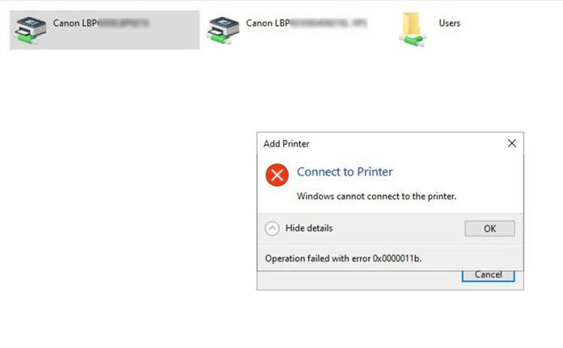
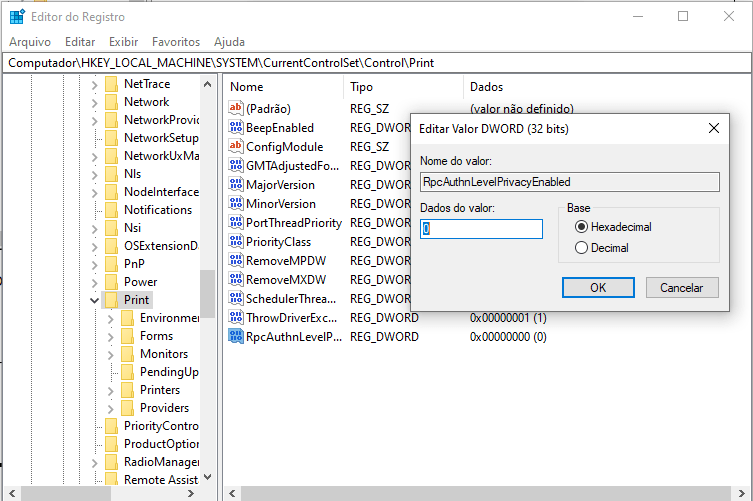

# [GTi Laboratory](https://github.com/systemboys/GTi_Laboratory#laborat%C3%B3rio-gti "Laboratório GTi") / Macetes técnicos

[](https://github.com/systemboys/GTi_Laboratory/raw/main/Microsoft%20Windows/Macetes/images/banner1.jpg "Macetes diversos para lidar com Windows")

- [Programas utilizados por advogados](./Advogados/README.md#gti-laboratory--programas-utilizados-por-advogados "Programas utilizados por advogados")
- [Como Ocultar uma Unidade de Disco no Windows 10: Guia Completo](#como-ocultar-uma-unidade-de-disco-no-windows-10-guia-completo "Como Ocultar uma Unidade de Disco no Windows 10: Guia Completo")
- [Como Pular a Solicitação de Conta Microsoft Durante a Instalação do Windows 11: Método OOBE\BypassNRO](#como-pular-a-solicita%C3%A7%C3%A3o-de-conta-microsoft-durante-a-instala%C3%A7%C3%A3o-do-windows-11-m%C3%A9todo-oobebypassnro "Como Pular a Solicitação de Conta Microsoft Durante a Instalação do Windows 11: Método OOBE\BypassNRO")
- [Corrigindo Erros ao Compartilhar Impressoras em Rede](#corrigindo-erros-ao-compartilhar-impressoras-em-rede "Corrigindo Erros ao Compartilhar Impressoras em Rede")
- 💡 [Dica Rápida – Abrir BIOS/UEFI pelo Windows via Comando](#-dica-r%C3%A1pida--abrir-biosuefi-pelo-windows-via-comando "Dica Rápida – Abrir BIOS/UEFI pelo Windows via Comando")

---

[(&larr;) Voltar](https://github.com/systemboys/GTi_Laboratory#laborat%C3%B3rio-gti "Voltar ao Sumário") | 
[(&uarr;) Subir](#gti-laboratory--macetes-t%C3%A9cnicos "Subir para o topo")

---

## Como Ocultar uma Unidade de Disco no Windows 10: Guia Completo

Para ocultar a unidade do disco rígido local E: no Windows 10, você pode seguir os passos abaixo:

1. **Abra o Gerenciamento de Disco:**
   - Pressione `Windows + X` e selecione "Gerenciamento de Disco".

2. **Encontre a Unidade E::**
   - Na janela do Gerenciamento de Disco, localize a unidade que você deseja ocultar (unidade E:).

3. **Remover a Letra da Unidade:**
   - Clique com o botão direito na unidade E: e selecione "Alterar letra de unidade e caminho...".
   - Na janela que abrir, clique no botão "Remover".
   - Uma mensagem de aviso aparecerá. Clique em "Sim" para confirmar.

A unidade E: será ocultada do Explorador de Arquivos, mas ainda estará acessível se você souber o caminho completo ou reassociar uma letra de unidade mais tarde.

### Alternativa usando o Editor de Política de Grupo

Se você preferir usar o Editor de Política de Grupo (disponível apenas em edições Pro e Enterprise do Windows 10), siga os passos abaixo:

1. **Abrir o Editor de Política de Grupo:**
   - Pressione `Windows + R`, digite `gpedit.msc` e pressione Enter.

2. **Navegar até a Configuração de Unidade:**
   - Vá até "Configuração do Usuário" > "Modelos Administrativos" > "Componentes do Windows" > "Explorador de Arquivos".

3. **Ocultar Unidades:**
   - No painel da direita, encontre e clique duas vezes em "Ocultar essas unidades especificadas em Meu Computador".
   - Selecione "Habilitado" e, em seguida, escolha a unidade E: na lista.
   - Clique em "OK" para aplicar as configurações.

### Usando o Editor do Registro (Regedit)

Outra opção é usar o Editor do Registro:

1. **Abrir o Editor do Registro:**
   - Pressione `Windows + R`, digite `regedit` e pressione Enter.

2. **Navegar até a Chave Correta:**
   - Navegue até `HKEY_LOCAL_MACHINE\SOFTWARE\Microsoft\Windows\CurrentVersion\Policies\Explorer`.

3. **Criar um Novo Valor DWORD:**
   - Clique com o botão direito no painel da direita, selecione "Novo" > "Valor DWORD (32 bits)" e nomeie-o como `NoDrives`.

4. **Definir o Valor:**
   - Clique duas vezes no novo valor `NoDrives` e insira o valor correspondente para ocultar a unidade E:.
     - O valor para E: é `16` (em decimal) ou `0x10` (em hexadecimal).
   - Clique em "OK" e reinicie o computador.

Seguindo esses passos, a unidade E: será ocultada do Explorador de Arquivos, mas ainda estará disponível para o sistema operacional e aplicativos.

[(&larr;) Voltar](https://github.com/systemboys/GTi_Laboratory#laborat%C3%B3rio-gti "Voltar ao Sumário") | 
[(&uarr;) Subir](#gti-laboratory--macetes-t%C3%A9cnicos "Subir para o topo")

---

## Como Pular a Solicitação de Conta Microsoft Durante a Instalação do Windows 11: Método OOBE\BypassNRO

Sim, o procedimento mencionado no título dessa abordagem para pular a tela de login da conta Microsoft durante a instalação do Windows 11 pode funcionar, dependendo de como for feito. A linha que você viu no título "oobe\byassnro" se refere a um comando que é inserido durante o processo de instalação do Windows 11, especificamente na fase conhecida como OOBE (Out-of-Box Experience).

Esse método funciona da seguinte maneira:

1. **Durante a instalação do Windows 11**, quando chegar à tela de login onde é solicitada uma conta da Microsoft, você pode pressionar a combinação de teclas **Shift + F10**. Isso abrirá uma janela de **prompt de comando (CMD)**.

2. No prompt de comando, você digita o comando:
   
   ```
   oobe\bypassnro
   ```

   Após isso, o Windows irá reiniciar a instalação, voltando para a tela inicial, mas agora permitirá que você configure o Windows sem a necessidade de uma conta Microsoft, possibilitando o uso de uma **conta local**.

Este método é frequentemente usado por técnicos ou usuários que preferem não vincular suas instalações a uma conta Microsoft ou que estão configurando sistemas em redes onde contas locais são mais viáveis.

Lembre-se que, em algumas versões e atualizações do Windows 11, a Microsoft pode mudar o comportamento desse bypass, e nem sempre garantirá que ele funcione, mas é uma solução conhecida e amplamente usada.

Se precisar de mais detalhes sobre como realizar o procedimento ou sobre alternativas, é só perguntar!

[(&larr;) Voltar](https://github.com/systemboys/GTi_Laboratory#laborat%C3%B3rio-gti "Voltar ao Sumário") | 
[(&uarr;) Subir](#gti-laboratory--macetes-t%C3%A9cnicos "Subir para o topo")

---

## Corrigindo Erros ao Compartilhar Impressoras em Rede



O erro **0x0000011b** ao conectar a uma impressora compartilhada geralmente ocorre devido a atualizações de segurança do Windows que afetam a autenticação de impressoras em rede.  

### Solução rápida:  
1. **No computador que compartilha a impressora (servidor):**  
   - Pressione `Win + R`, digite **regedit** e pressione `Enter`.  
   - Navegue até:  
     ```
     HKEY_LOCAL_MACHINE\System\CurrentControlSet\Control\Print
     ```
   - Clique com o botão direito, selecione **Novo > Valor DWORD (32 bits)** e nomeie como:  
     ```
     RpcAuthnLevelPrivacyEnabled
     ```
   - Dê um duplo clique nele e defina o valor para **0**.  
   - Feche o Editor do Registro e **reinicie o computador**.  

2. **No computador que está tentando acessar a impressora:**  
   - Pressione `Win + R`, digite `\\NOME-DO-SERVIDOR` e pressione `Enter`.  
   - Clique com o botão direito na impressora e selecione **Conectar**.  



[(&larr;) Voltar](https://github.com/systemboys/GTi_Laboratory#laborat%C3%B3rio-gti "Voltar ao Sumário") | 
[(&uarr;) Subir](#gti-laboratory--macetes-t%C3%A9cnicos "Subir para o topo")

---

## 💡 Dica Rápida – Abrir BIOS/UEFI pelo Windows via Comando

### **Descrição**

O comando `shutdown /r /fw /t 1` reinicia o computador e força a entrada na BIOS/UEFI sem precisar pressionar teclas na inicialização.

### **Sintaxe**

```cmd
shutdown /r /fw /t 1
```

### **Parâmetros**

* **`/r`** → Reinicia o sistema.
* **`/fw`** → Direciona a inicialização para o firmware (UEFI/BIOS).
* **`/t 1`** → Tempo de espera para desligar/reiniciar (em segundos).

### **Pré-requisitos**

* Computador com **UEFI** (não funciona em BIOS legado).
* Suporte habilitado no firmware para inicialização rápida na BIOS.
* Windows 8 ou superior.
* Permissões de **administrador**.

### **Execução local**

1. Abra **Prompt de Comando** ou **PowerShell** como Administrador.
2. Execute:

   ```cmd
   shutdown /r /fw /t 1
   ```
3. Aguarde a reinicialização — a máquina entrará diretamente na BIOS/UEFI.

### **Execução remota (via PsExec)**

```cmd
psexec \\NOME_DO_PC -u ADMINISTRADOR -p SENHA shutdown /r /fw /t 1
```

> Troque `NOME_DO_PC`, `ADMINISTRADOR` e `SENHA` pelas credenciais corretas.

### **Observações**

* Evite rodar em máquinas críticas sem aviso — reinicia quase instantaneamente.
* Em alguns notebooks, requer **Fast Boot** ativo.
* Útil para suporte remoto, evitando perda de tempo tentando apertar teclas no boot.

[(&larr;) Voltar](https://github.com/systemboys/GTi_Laboratory#laborat%C3%B3rio-gti "Voltar ao Sumário") | 
[(&uarr;) Subir](#gti-laboratory--macetes-t%C3%A9cnicos "Subir para o topo")

---
